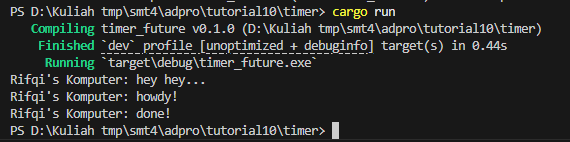
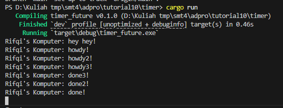
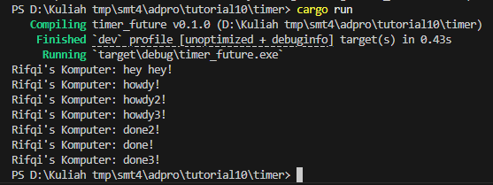

## Experiment 1.2: Understanding how it works

### What was changed

I added a `println!` statement right after the `spawner.spawn(...)` line in `main.rs`:

```rust
spawner.spawn(async {
    println!("Rifqi's Komputer: howdy!");
    TimerFuture::new(Duration::new(2, 0)).await;
    println!("Rifqi's Komputer: done!");
});

println!("Rifqi's Komputer: hey hey...");
```

### Output

When running the program, the output is:



### Explanation

The reason `Rifqi's Komputer: hey hey...` appears before the async task output is because `spawner.spawn(...)` only schedules the async task to be run later. The code inside the async block does **not** execute immediately. Instead, the main thread continues and prints `hey hey...` right away.

The async task (printing "howdy!", waiting, then printing "done!") only starts running when the executor (`executor.run()`) begins processing the scheduled tasks. That happens **after** "hey hey..." is printed.

**In summary:**  
- `spawn` schedules the async task, but does not run it immediately.
- The main thread prints "hey hey..." right away.
- The executor then runs the async task, printing "howdy!", waiting, then "done!".

---

## Experiment 1.3: Multiple Spawn and removing `drop`

### What was changed

I replicated the spawn three times to create multiple async tasks, and then experimented with commenting out the `drop(spawner);` line in `main.rs`:

```rust
spawner.spawn(async {
    println!("Rifqi's Komputer: howdy!");
    TimerFuture::new(Duration::new(2, 0)).await;
    println!("Rifqi's Komputer: done!");
});
spawner.spawn(async {
    println!("Rifqi's Komputer: howdy2!");
    TimerFuture::new(Duration::new(2, 0)).await;
    println!("Rifqi's Komputer: done2!");
});
spawner.spawn(async {
    println!("Rifqi's Komputer: howdy3!");
    TimerFuture::new(Duration::new(2, 0)).await;
    println!("Rifqi's Komputer: done3!");
});

println!("Rifqi's Komputer: hey hey...

// drop(spawner); // This line was commented out

executor.run();
```

### Output

When running the program with `drop(spawner);` **commented out**, the program hangs and does not terminate after printing the async task outputs.  



When `drop(spawner);` is **present**, the program runs all tasks and then exits as expected.



### Explanation

The `drop(spawner);` statement is important because it signals to the executor that no more tasks will be spawned. If you do **not** drop the spawner, the executor's task queue never closes, so `executor.run()` waits forever for new tasks, causing the program to hang.

**In summary:**  
- With `drop(spawner);`, the executor knows when all tasks are done and exits cleanly.
- Without `drop(spawner);`, the executor waits forever, and the program never finishes.

---